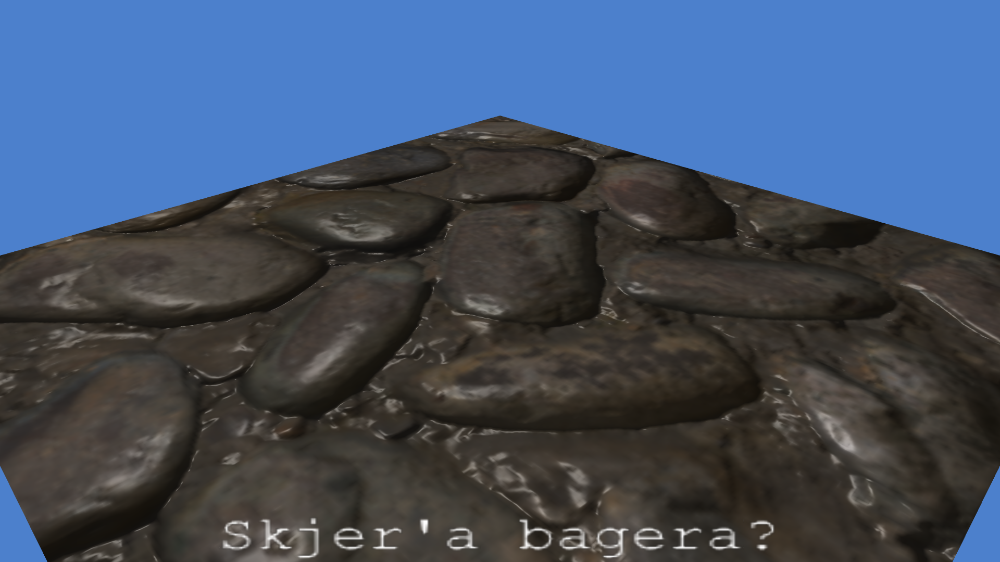
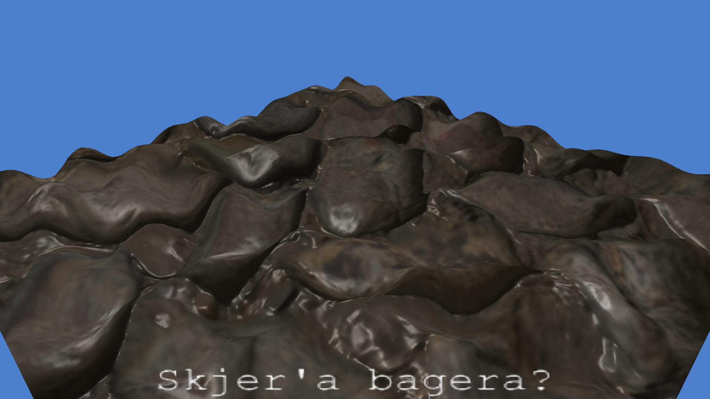
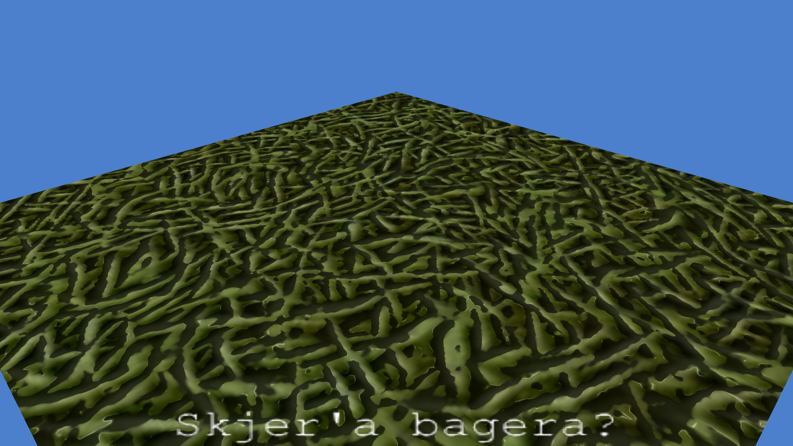
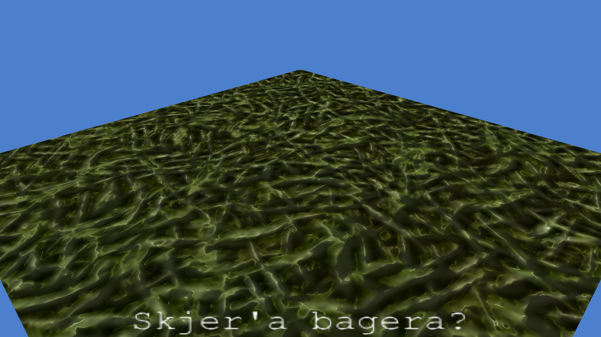
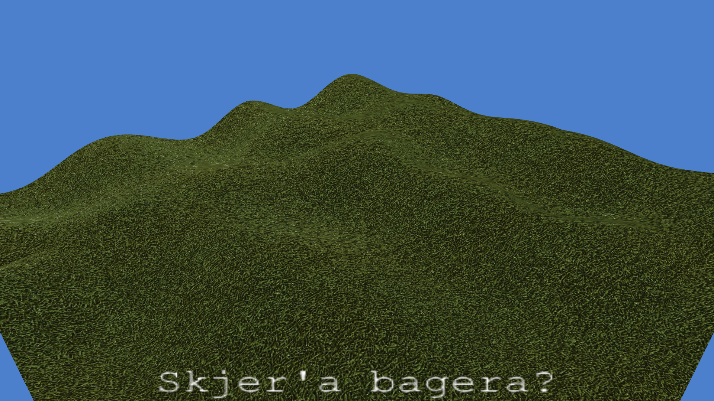
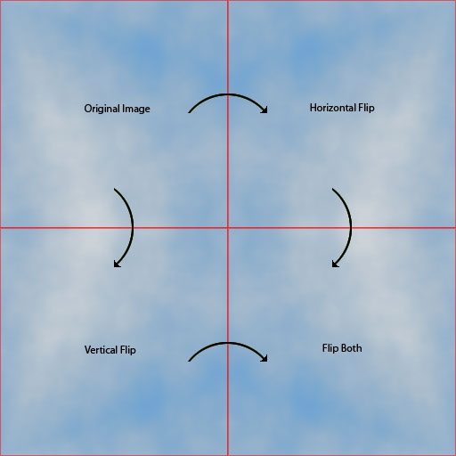
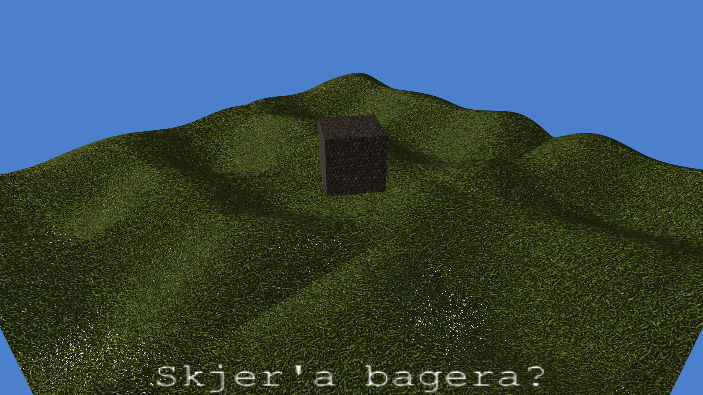

# Creating the hills

To make my plane of grass I first needed a plane. I added a generator function in `glutils.cpp` which makes a segmented plane for me with as many vertices and faces as specified. This was needed since I plan to add a displacement map capability, but only do so in the vertex shader. I thus need a lot of vertexes. The other route would be to make a texel shader which divides the faces into smaller faces and use it on the plane, which would save memory bandwith. But making it from the start is the easier option.

I added the plane to the scene and set the cobble texture on it.

It didn't look right, so I went through the shader again to make sure the lighting was correct. I failed to pass the specular shininess factor properly as a uniform. I also had failed to account for the specular component being negative (before raising it to the power of the shininess). I added this check and now the lighting looks correct.



While at it I added the ability to specify all the color components and the attenuation per light source. With this I'm able to create a sun far away without being bothered by attenuation.

Now for the displacement of the plane. I created a `PNGImage` generator function which generates a perlin noise texture with the amount of layers and scales specified.
This I registered as the displacement texture for the plane. In the vertex shader I added a `isDisplacementMapped` uniform shader flag which adds the normal vector multiplied by the displacement to each vertex.



```{.shebang im_out="stdout"}
#!/usr/bin/env bash
echo A M A S I N G | boxes -d unicornsay -a c -p h10
```

I've yet to modify the normals from the displacement, so the hill currently won't cast shadows. I currently don't have a plan on how to fix this. Perhaps use the bitangents to calculate the slope of the displacement in the vertex shader?

At this point I went online a found myself a grass texture and normal map.



```{.shebang im_out="stdout"}
#!/usr/bin/env bash
printf "   Something's wrong...!   \n" | cowsay -f head-in | sed -e "s/^/              /"
```

Apparently, the direction of the normal map colors aren't the same everywhere. I therefore added a flag to the image loader function which will flip the handedness. (inverting the R and G channels).



*Much better*

Now we'll up the granularity by decreasing the UV step per vertex along the plane, and enable the displacement map:



## Scrolling the field

Now, how can we scroll this plane?

I decided the easies way would be to add a uniform variable called `uvOffset` to the vertex shader. Now I can simply scroll the plane by adding to this offset to all the UV coordinates in the vertex shader before passing it to the fragment shader:

```c++
/*vec2*/plainNode->uvOffset += /*vec2*/speed * timeDelta;
```

The code above works since I added in some operator overloads for `vec2`, `vec3`, and `vec4` with scalars.

Now we unfortunately see steep cuts where the perlin noise texture repeats. This we simply fix by mirroring the texture on repeat with `GL_MIRRORED_REPEAT`:



An another solution to making the perlin noise repeatable is to pass the repeat size into the `glm::gtx::perlin` function as I create the texture. But as of now I chose the quick and dirty solution. It also has the added effect of creating a less repeating texture. It repeats from 0-2 instead of 0-1.

At this point I was stuck with a bug where the coordinates of the lights were doubled. After two days of debugging I found the line where I update pass the light position into the uniform in the fragment shader:

```c++
lights[id].position = vec3(node->MV * vec4(node->position, 1.0));
```

Which *should* have been 

```c++
lights[id].position = vec3(node->MV * vec4(vec3(0.0), 1.0));
```

*...yeah.*

## Normal mapping the displacement

After that goober, I moved on to try to rotate the normals according the displacement map. After some playing around I landed on this solution in glsl:

\small
```c++
if (isDisplacementMapped) {
	float o = texture(displaceTex, UV).r * 2 - 1;
	float u = (texture(displaceTex, UV + vec2(0.0001, 0)).r*2-1 - o) / 0.0004; // magic numbers!
	float v = (texture(displaceTex, UV + vec2(0, 0.0001)).r*2-1 - o) / 0.0004; // magic numbers!
	TBN = mat3(
		normalize(tangent   + normal*u),
		normalize(bitangent + normal*v),
		normalize(cross(tangent + normal*u, bitangent + normal*v))
	);
}
```
\normalsize

Here I find the slope along the displacement map along the `U` and `V` direction. `o` is the 'origin', and `u` and `v` are the tangent and bitangent slope cosines *(derived with the help of a few magic numbers which should be made into uniforms really,s ince they only apply for the plane as of now)*. Using these cosines I can simply add the normal vector multiplied by the cosine to the tangent and the bitangent and normalize them, giving me the new tangents. I can from here derive the new normal vector by simply computing the cross product of the two tangents.

This did however give me a pretty coarse image, so I moved the computation of the TBN matrix from the vertex shader to the fragement shader. This will give me a slight performance penalty, but I can undo the change in a simplified shader should I need the performance boost later. Here we can see how the displacement affects the normals along the displaced plane:



```{.shebang im_out="stdout"}
#!/usr/bin/env bash
echo Windows XP background incoming? | boxes -d whirly -a c -p h15
```
