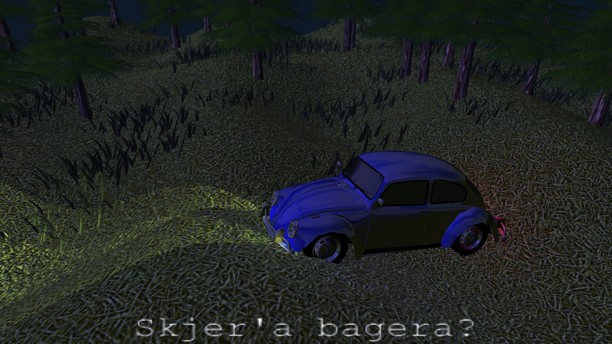

# Creating the scene

For now, I decided to change the scene into what I imagine the end result to be like. The idea is to have a car drive along the moving field, moving along the slope of the field. The car should have some headlights and backlights as well.

To be able to do this, I had to implement bilinear filtering on the PNGImage struct, to be able to read the displacement map where the car is at, so i can calculate the slope.

I then made the trees and the grass scroll along the movement of the offset displacement map, wrapping around when leaving the edge of the field.
I then added a check to see if any of the trees or grass which wrapped around is in the path of the car or not. If it is, then I make them invisible. This ensures there ar no obstacles in the path of the car, avoiding unseemly clipping.

I then changed the lightning to be at night time. To have this make sense, I tweaked the shader so that the color of the first light is multiplied by the emissive component of the objects. This allows me to use the first light to set the "ambient tone" of the scene. Will be handy.

The scene is pretty dark now, so I added in some spot lights attached to the front lights of the card, which are transformed along with the car.
They look a bit mechanical alone, so I added in four point lights aswell, two attached to the front lights, and two attached to the back lights with a red hue. This blends together pretty well.

