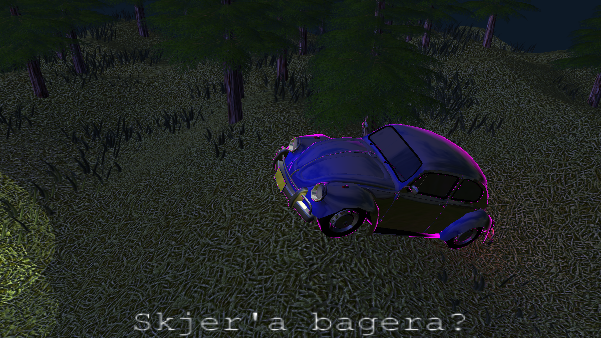
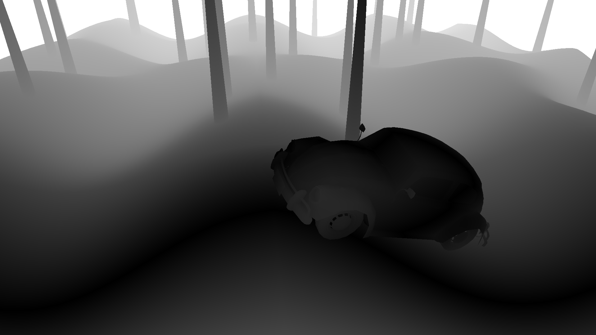
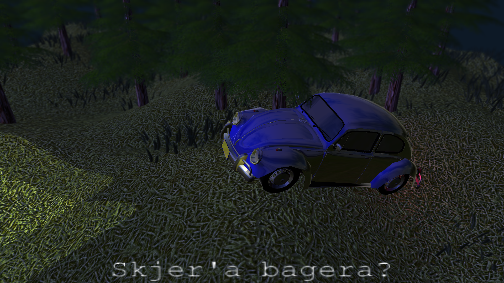
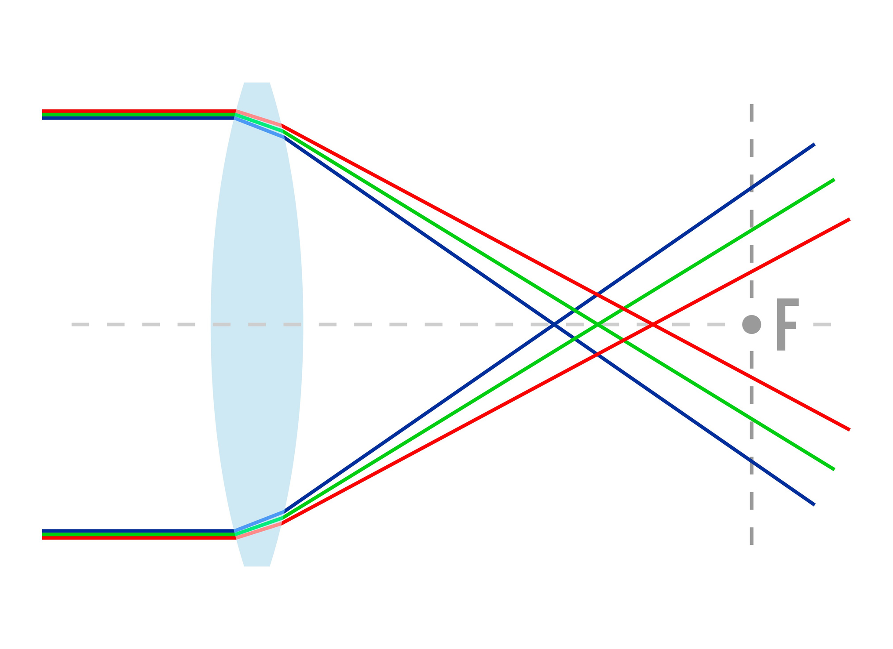
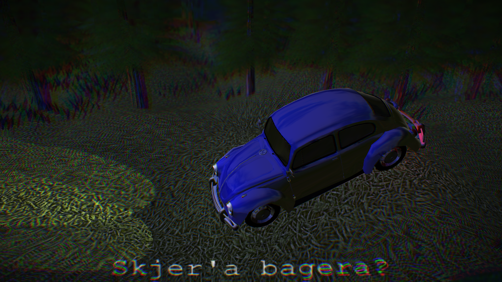

# Adding effects

The car however blends into the backround now. To make it pop a bit more, I added support for a rim light color in the shader.
I don't know how these are usually done, but I simply opted for the intuitive implementation I thought out.
The more the surface normal points away from the camera, the more it should be lit up. When the surface is pointing 90 degrees away from the camera it should be at maximum brightness, and it should decrease the more it points toward the camera. Using the dot product between the normalize position vector and the normalize normal vector in MV space gives me a cosine. Now I have a value of 1 when pointing away from the camera, 0 when pointing 90 degrees to the side and a value of -1 when pointing towards the camera. Adding a "strength" uniform value to this will skew it towards the camera. I then divide it by this same strength value and clamp it between 0 and 1 to have it be 0 when pointing towards the camera and 1 when pointing to the side. This value is multiplied by a rim light color component.

```c++
c.rgb += backlight_color * clamp((dot(normalize(vertex), normal)
	+ strength) / strength, 0, 1);
``` 

Below you can see an exaggerated use of the effect:



Setting the rim light color to a weak white color makes the car pop just so slightly more from the surroundings.

## Post processing

Now is the time to add in the post-processing step to the rendering pipeline.
The idea is to render the scene not directly to the window, but to an internal frame buffer. Then I can, using two triangles, render this framebuffer to the window as a texture using a separate shader, henceforth refered to as the post shader. The post shader has the ability to combine the color and depth buffer values of not just a single pixel, but also its neighbors. This allows me to implement effects such as blur and depth of field.

This took  quite a lot of time. GL isn't the most verbose debugging companion to work with, and I was blessed with a lot of issues and weird behaviors with the framebuffers. After a few days I got it working again.

```c++
#version 430 core
layout(binding = 0) uniform sampler2D framebuffer;
layout(binding = 1) uniform sampler2D depthbuffer;
layout(location = 0) out vec4 color_out;
uniform uint windowWidth;
uniform uint windowHeight;

void main() {
    vec2 dx = vec2(1,0) * 1.0/windowWidth;
    vec2 dy = vec2(0,1) * 1.0/windowHeight;
	vec2 UV = gl_FragCoord.xy / vec2(windowWidth, windowHeight);
    color_out = texture(framebuffer, UV);
}
```

This simple fragmentshader allows me to make a depth of field effect. Here is a visualization of the depthbuffer, after transforming it to be 0 around the focal distance where the car is at, and tend towards a value of 1 otherwise. This "focus value" is stored as `z` in the shader, should you start wondering in the code further below:



Here we can see the transparent objects (grass and leaves), which was rendered with the depth buffer in read only mode, doesn't show up on the depth buffer. Due to this I'm unable to use this depth buffer as fog since it would look weird. But if I want fog I can do that in the normal shader anyway. This depth map will suffice in my dark scene for effects such as depth of field.

## Depth of Field

Depth of field is a blur dependent on distance from the focal point. I planned on computing a weighted average for each pixel, where the weight per neighbor is their depth. This computation proved expensive however, due to all the access to the depthbuffer. Therefore I arrived at this simplified model instead:

```c++
int radius = int(5*z); // z=0 in focus, otherwise -> 1
vec3 color = vec3(0);
for (int x = -radius; x <= radius; x++)
for (int y = -radius; y <= radius; y++)
	color += texture(framebuffer, UV + x*dx + y*dy).rgb;
color /= pow(2*radius+1, 2);
color_out.rgb = color;
```

Resulting in:



A weakness with this depth of field model effect though is that the edges of objects don't blur, only the surfaces. At a distance it looks okay, but elements in the foreground; in front of the point of focus, will look weird.

I could try replacing the trees with non-transparent ones for a more detailed effect.

## Vignette

Next up I wanted to try adding a simple vignette to the mix. Simply computing the euclidian distance from the center of the screen is doable with the UV coordinates:

```c++
color_out = vec4(color.rgb * (1-pow(length((UV-0.5)*1.2), 3)), color.a);
```

When `color.rgb` is all white, we get the output:


Which demonstrates the effect of the vignette quite clearly.

## Chromatic Aberration

Chromatic aberation is the effect of the different frequencies of light refracting differently. This is demonstrated in the figure below:



As we can see, the further away we are from the focal point, the more aberration we ought to have. The aberration also gets worse the closer to the edge of the lens we move. I therefore added in the aberration as a modification to the depth of field effect, where I read the color values from the framebuffer anyway. I now scale the UV vector into the framebuffer according the depthbuffer and the aberration factor per color component:

```c++
for (int x = -radius; x <= radius; x++)
for (int y = -radius; y <= radius; y++){
	vec2 p = UV + x*dx + y*dy;
	color.r += texture(framebuffer, (p-0.5)*(1+z*chomatic_aberration_r) + 0.5).r;
	color.g += texture(framebuffer, (p-0.5)*(1+z*chomatic_aberration_g) + 0.5).g;
	color.b += texture(framebuffer, (p-0.5)*(1+z*chomatic_aberration_b) + 0.5).b;
}
```

An exaggerated example:



## Grain

Next up I wanted to add some grain. GLSL doesn't have a random number generation function built in, but I found one online which was based around using a UV vector. I further modified it to use a time uniform as well making it vary per frame.


The grain in the middle of the screen however doesn't look good, so here again I opted to add more grain where the scene is out of focus using the depth buffer. I could also make it a part of the vignette, but I think using the depth buffer value looks better for this scene. I simply do this:

```c++
color += (random(UV)-0.5) * z * 0.2;
```

All these effects comes together into this final product:


