# Loading models

Now I want to load the car model I found online. After downloading the car model from `sketchfab.com`, I added `assimp` as a submodule to the project repository. I then linked in the library using cmake. From here I had to make a few helper functions to read the models and parse them into the already established structs and classes.

*This took some time.*

Here I finally loaded all the vertices and faces:

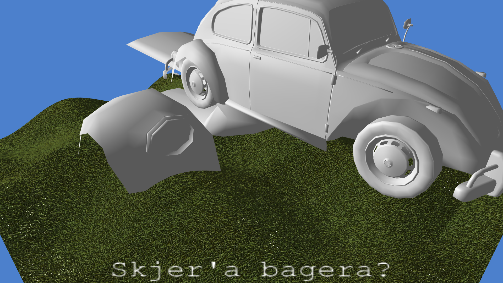

Here I applied all the model transformations for each sub mesh:

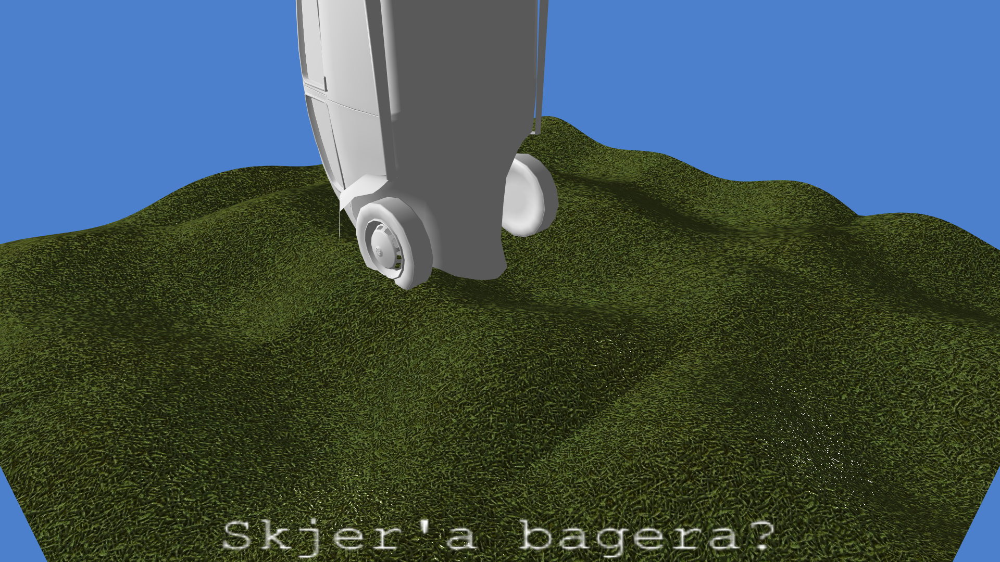

Here I accounted for the difference in coordinate systems. I prefer to have the Z component point skyward. 

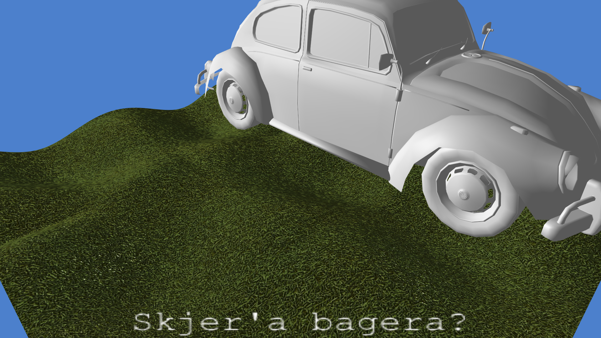


## The material system

Now it's time to load the properties from the models. To do this I had to implement a material system. Here I loaded all the materials and loaded the material diffuse color and the color vertices. To make this work I had to expand the shader to accept colors per vertex.

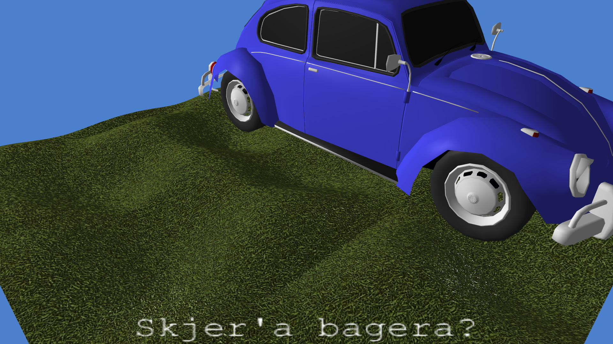

Formalizing the materials as a struct allows me to apply it recursively to a `SceneNode` and its children should I wish to do so. I also need to expand the model loader to read textures, but I'll cross that bridge when I get to it.

But for now, it's time for a revamp of the lighting system, yet again!
Instead of having a diffuse, specular and emissive color component per light source, I'll have a single color per light and instead store the color components per `SceneNode`. This allows me to set material properties per node in the scene. The lights will now only store the basecolor and attenuation coefficients.

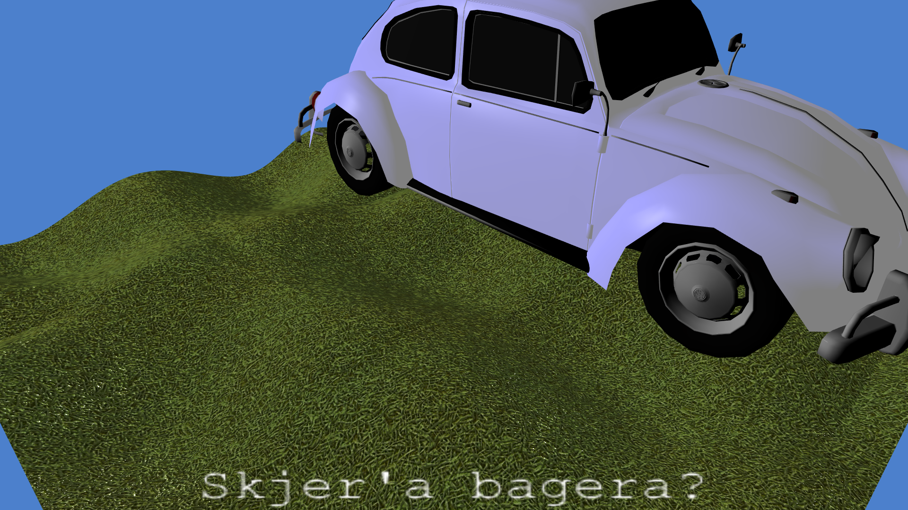

In the image above the shader uses the emissive and specular colors per node in the scene. Seems like the car model is expecting a metal effect on top. The emissive colors are pretty bright.

This is a good excuse to create a reflection map shader!

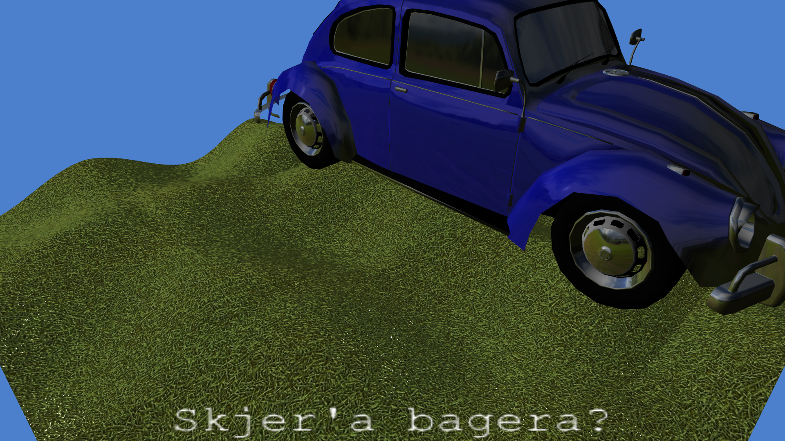

This car looks *nice*.

I opted to implement the reflection shader by reflecting the vector from the camera to the fragment by the normal vector. I then map the reflection vector into UV coordinates as if it covers a sphere. I the found some 360 images online to use as the reflection map texture:

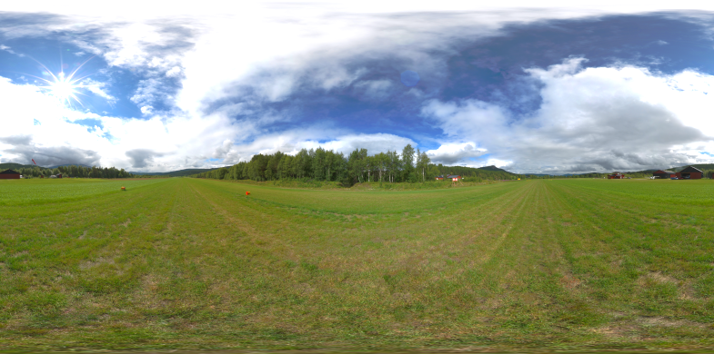

The color extracted from the reflection map can then be mixed with the diffuse and emissive colors in two ways in my shader:

```cpp
basecolor = (reflexiveness < 0)
	? basecolor * mix(vec3(0.0), reflection, -reflexiveness)
	: mix(basecolor, reflection, reflexiveness);
```

A `reflexiveness` value between 0 and -1 will multiply the reflection with the base color, after having mixed the reflection with white using `-reflexiveness` as the interpolation factor.

A `reflexiveness` value between 0 and 1 will instead mix the reflection with the basecolor directly using `reflexiveness` as the interpolation factor.

I've yet to define *'basecolor'*. The basecolor is the emissive and diffuse parts of the phong model. This is roughly how I compute them. $a(m)$ is the attenuation:

$a(m) = x + y\cdot |L_{m}| + z\cdot |L_{m}|^2 \\
basecolor_{frag} =
	k_e + k_d * \sum_{m\in lights}{\frac{\hat{L}_m \cdot \hat{N}}{a(m)}} \\
finalcolor_{frag} =
	reflection(basecolor) + \sum{\frac{k_s(\hat{R}_m\cdot \hat{V})^\alpha}{a(m)}}$

The specular component is added in after having mixed with the reflection.

## Textures

The scene is supposed to have both trees and grass loaded as well, let's try loading in the tree model I found online:

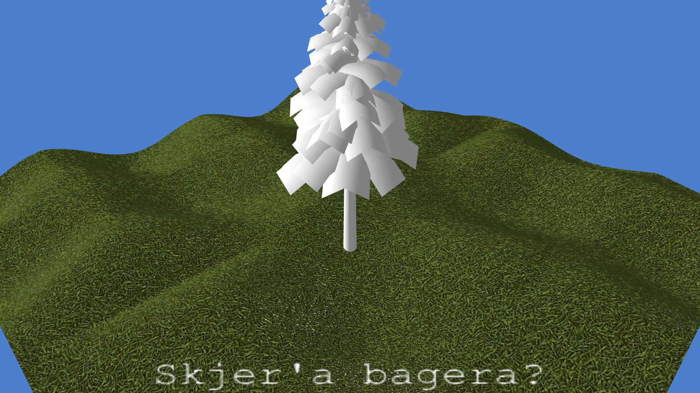

Textures aren't loaded yet, I knew this day would come sooner or later. Thanks to all the work that went into the material system, loading models was a quick fix. *(after recieving a thourough beating from `assimp`)*

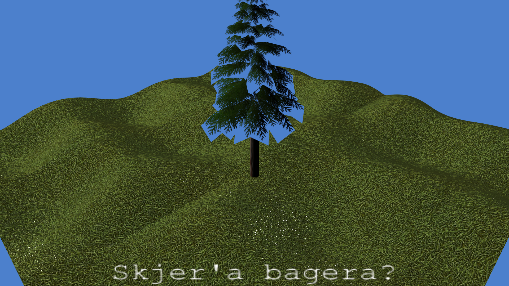

## Transparancy

Seems like the transparent textures are rendered before the field, making the field fail the depth test. Seems like I have to sort and render all nodes with any partial opacity and render them last. Sorted by distance from camera. Hang on a minute...

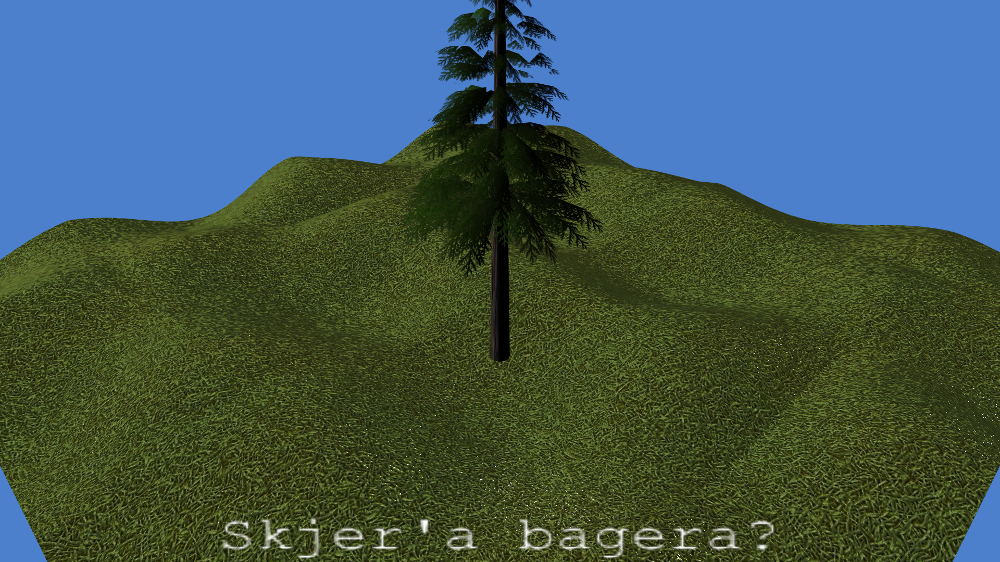

Huh, it *kinda* works, since all transparent objects now are rendered at last in sorted order. But within a single mesh we still have depth priority issues. The topmost leaves on the tree pictured above was rendered before the lower ones.

One idea I tried out was disabling the depth test while rendering the transparent objects. For this scene, it looked ok, but if we where to have an opaque object in front of the tree, we would see the leaves on top.
No opaque object, being rendered earlier than the transparent ones, would be able to occlude it.

After some reading and searching around I found this neat option in OpenGL:

```c++
glDepthMask(GL_FALSE);
```

This will make the depth buffer read only, locking the depth buffer in place. If I first render all opaque objects while the depth buffer is writeable, then lock the depth buffer and render the opaque objects in sorted order, I get a nice compromise. Opaque objects will be able to occlude transparent ones, due to the depth test, but transparent ones don't affect the depth test. Since the transparent objects are sorted by the distance from the camera, they will be rendered on top of another in the correct order anyway. The only issue is with transparent meshes which overlap. There is still some weirdness in the tree leaves since it is a single mesh, but nothing too noticeable in leaves and bushes.

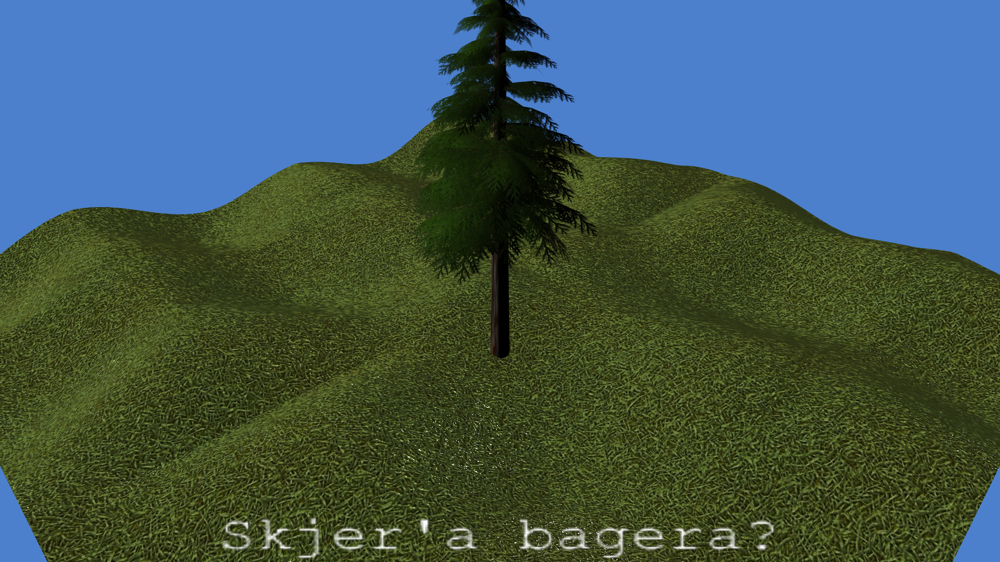

Neato!

The current rendering pipeline:

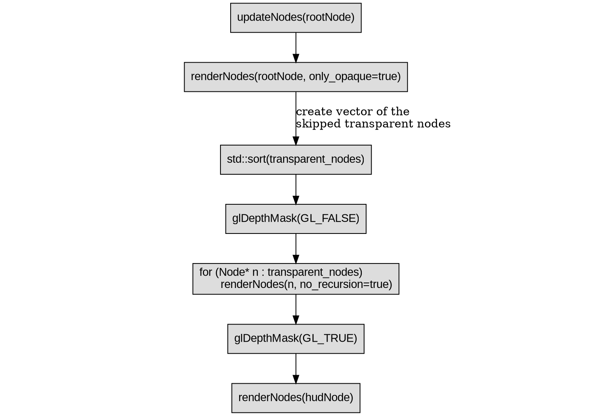

Now we are rendering something which looks *kinda* nice. I then had the model loader load my grass model, and duplicated it roughly a hundred times. This model has a single grass mesh which it uses 64 times in a "cluster" of grass. All of these uses transparent textures. Since I decided to add quite a few of these into the scene graph I started to notice some issues with performance. After I added a few helpful print statement, I was delighted to learn that I'm trying to render **5455** nodes with geometry.

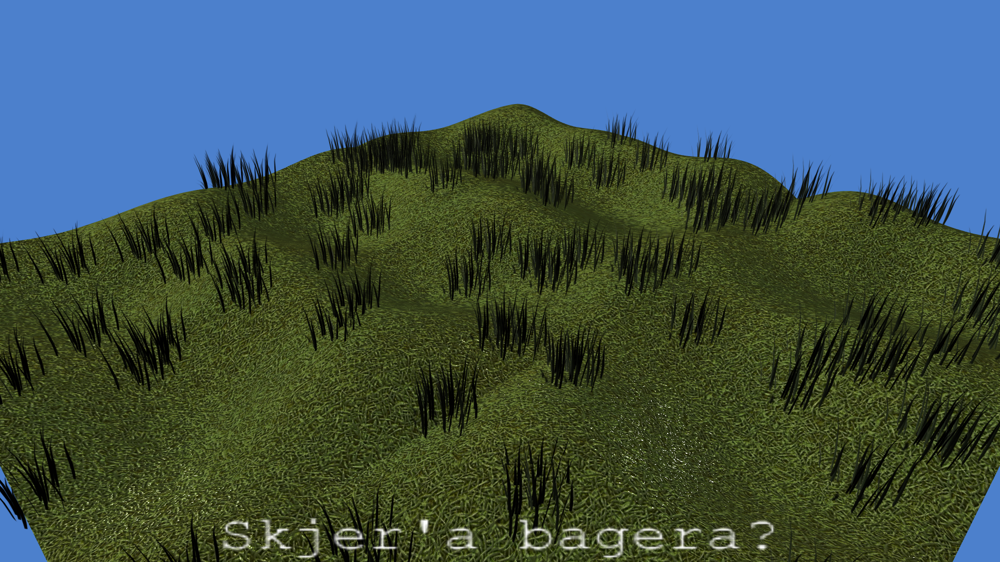
